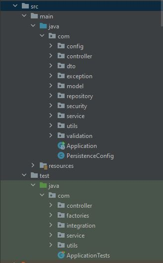
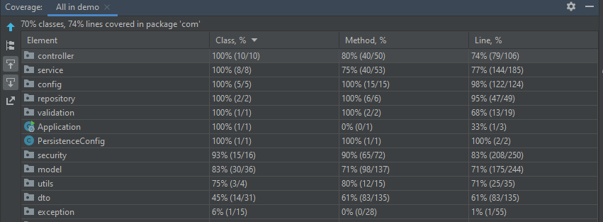

# IDATT2105-Prosjekt
 

## Krav for å kjøre applikasjonen
### Backend
- [Maven](https://maven.apache.org/download.cgi)
- [Docker](https://docs.docker.com/get-docker/)

### Frontend
- [Yarn](https://classic.yarnpkg.com/en/docs/install/#debian-stable):
```bash
npm install -g yarn
```

## Installasjon

```bach
git clone https://github.com/stianmogen/IDATT2105-Prosjekt.git
```

### Backend

```bash

cd IDATT2105-Prosjekt\backend

# With Maven  
#The application runs on port 8080
docker-compose up & mvn dependency:resolve && mvn spring-boot:run

# With Docker-compose
docker-compose -f docker-compose.yml build
docker-compose -f docker-compose.yml up

```

### Frontend

```bash

cd IDATT2105-Prosjekt\frontend

# Set url to api in env-file
echo REACT_APP_API_URL=http://localhost:8080/  > .env

# Install dependencies
yarn 

# Run the app
yarn start
```

Det er lagt inn 3 brukere med ulike roller som kan brukes ved testing:

User:
- Epost: user@user.com
- Passord: user

Moderator:
- Epost: moderator@moderator.com
- Passord: moderator

Admin:
- Epost: admin@admin.com
- Passord: admin


# Introduksjon

Prosjektoppgave i faget IDATT2105, prosjektet er gjennomført av
- Lars Brodin Østby
- Simon Jensen
- Nicolay Schiøll-Johansen

# Funksjonalitet

- Brukerregistrering
- Innlogging
- Se rom
- Roller for administrator, moderator og bruker
- Reservere seksjon av et rom en periode
- Filtrering på rom (uferdig)
- Pagination på visningssider
- Sikkerhet (se eget punkt)

## Nåverende mangler

Som følge av mangel på tid, og mangelfull beregning av tid, har en stor del av applikasjonens funksjonalitet på serversiden, ikke blitt implementert i brukergrensesnitte. I tillegg til funksjonaliteten nevnt over, har vi derfor følgende funksjonalitet klar på serversiden:

- Filtering på rom, basert på eksistrende reservasjoner av rommets seksjoner
- Filtering på seksjon, slik at kun ledige seksjoner vises på visningssiden
- Opprettelse, sletting og oppdatering av bygning, rom og seksjon for administrator
- Sletting av reservasjon
- Sletting av bruker

Det er beklagelig at denne funksjonaliteten ikke kom på plass, derimot tar vi læring fra det til neste prosjekt. 

# Arkitektur

Strukturen på backend følger den lagdelte arkitekturmodellen i Springframework.
- Controller: Endepunkter
- Service: Service metoder for endepunktene 
- Repository: Kommuniserer med databasen, brukes av service
- Model: Enitene, det som lagres i databasen
- Dto: Lagres ikke i databasen, men lar oss sende data mellom frontend/backend

 

# Sikkerhet
Dette prosjektet er bygd opp rundt REST prinsipper, og benytter seg der også av stateless authentication ved bruk av JWT (JSON Web Tokens). Ved innlogging vil en bruker ha en access token samt en refresh token. Det er access token som gir en bruker tilgang til plattformen, men etter en satt tid på 15 minutter vil gyldigheten til denne tokenen gå ut. Når dette skjer vil refresh tokenen automatisk bli brukt. En refresh token vil bare kunne benyttes én gang. I tilfeller hvor det blir prøvd å gjenbruke en refresh token vil alle de kommende refresh tokenen som skulle blitt utgitt til brukeren bli ugyldig. 

Passord blir lagret i databasen med Bcrpyt algoritme samt være saltet for å sikre passordene på best mulig måte i databasen. 

Av sikkerhetsmessige grunner er det strengt hvilke brukere som har tilgang til hvilke endepunkter. En bruker vil få en rolle (USER, MODERATOR, ADMIN), som tilsier hvor mye tilgang de vil ha på systemet. 


## Teknologier
- React - Et rammevært til Javascrip for å lage grensesnitt
- Spring Boot - Et rammevært som server-siden
- Spring JPA - For enkel implementasjon av JPuerA repositories
- QueryDLS - Tillater statisk skrevet queries
- Docker - Et rammeverk for konteinerisering
- H2 Database Engine - En in-memory database
- Swagger - API dokumentasjon
- JWT -  Stateless autentiseringsmekanisme


# API dokumentasjon 

Alle kontroller klasser er dokumentert med Swagger: http://localhost:8080/swagger-ui/ 

# CI

CI har blitt kjørt på backend ved bruk av Github Actions. 
Pull-Requests har måtte gå gjennom alle testene, samt build av Maven, for å kunne bli merget. 

Test-coverage på backend:



